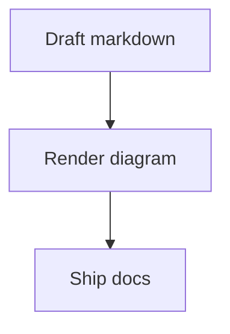

# pd-markdown-ui

Markdown primitives for `pd-shad-ui`, with React and Vue entrypoints, Shiki-powered code blocks, Mermaid diagrams, and a sensible default plugin bundle for GFM, math, and KaTeX.

## Why use it

- Shared visual language: Markdown output matches the same typography, spacing, tables, and code treatment as `pd-shad-ui`
- Dual-framework ready: `pd-markdown-ui` for React, `pd-markdown-ui/vue` for Vue
- Better code blocks by default: Shiki highlighting, copy action, theme control, and extensible language support
- Mermaid diagrams: fenced `mermaid` blocks render as diagrams with configurable theme and container styles
- Batteries included: `defaultMarkdownPlugins` wires up `remark-gfm`, `remark-math`, and `rehype-katex`

## Installation

```bash
pnpm add pd-markdown-ui pd-shad-ui
```

## Style imports

Import the compiled Markdown styles once in your app shell:

```tsx
import "pd-markdown-ui/styles.css";
```

If you also render math through the default KaTeX plugin bundle, import KaTeX styles once as well:

```tsx
import "katex/dist/katex.min.css";
```

If your app renders `pd-shad-ui` components outside Markdown, import `pd-shad-ui/styles.css` once as well:

```tsx
import "pd-shad-ui/styles.css";
import "pd-markdown-ui/styles.css";
import "katex/dist/katex.min.css";
```

The CSS entries are precompiled package styles. Consumers do not need to configure Tailwind to scan `pd-markdown-ui` or `pd-shad-ui` package files.

## Package entrypoints

- React: `pd-markdown-ui`
- Vue: `pd-markdown-ui/vue`
- Styles: `pd-markdown-ui/styles.css`

Both entrypoints export:

- `components`
- `defaultMarkdownPlugins`
- `trustedMarkdownPlugins`
- individual primitives such as `H1`, `P`, `Code`, `MarkdownTable`
- code highlight helpers such as `setMarkdownCodeConfig`
- Mermaid helpers such as `setMarkdownMermaidConfig`

## React quick start

```tsx
import "pd-shad-ui/styles.css";
import "pd-markdown-ui/styles.css";
import "katex/dist/katex.min.css";

import ReactMarkdown from "react-markdown";
import {
  components,
  defaultMarkdownPlugins,
} from "pd-markdown-ui";

export function MarkdownArticle({ content }: { content: string }) {
  return (
    <ReactMarkdown
      components={components}
      remarkPlugins={defaultMarkdownPlugins.remark}
      rehypePlugins={defaultMarkdownPlugins.rehype}
    >
      {content}
    </ReactMarkdown>
  );
}
```

## Vue quick start

Vue markdown stacks vary more than React, so `pd-markdown-ui/vue` stays renderer-agnostic.
The usual pattern is to keep your existing parser, then map Markdown nodes to the exported Vue components.

```ts
import "pd-shad-ui/styles.css";
import "pd-markdown-ui/styles.css";
import "katex/dist/katex.min.css";

import {
  Code,
  H1,
  MarkdownTable,
  P,
  components,
  defaultMarkdownPlugins,
  trustedMarkdownPlugins,
} from "pd-markdown-ui/vue";

export const markdownComponents = {
  ...components,
  h1: H1,
  p: P,
  code: Code,
  table: MarkdownTable,
};

export { defaultMarkdownPlugins };
export { trustedMarkdownPlugins };
```

If your Vue setup uses a renderer such as `@nuxt/content`, `markdown-it`, or a custom mdast pipeline, keep that renderer in place and plug these exported primitives into its component mapping layer.

## Code highlighting

`Code` and `Pre` now share one highlighter configuration layer across React and Vue.
By default the package uses:

- `github-light`
- `github-dark`
- `auto` theme mode
- a built-in set of common languages for app docs and product content

You can adjust that globally without changing every component call site:

```ts
import { setMarkdownCodeConfig } from "pd-markdown-ui";

setMarkdownCodeConfig({
  defaultTheme: "dark",
  languages: ["typescript", "tsx", "bash", "json", "md"],
});
```

Available theme modes:

- `light`
- `dark`
- `auto`

## Mermaid diagrams

Fenced `mermaid` code blocks are rendered through Mermaid instead of the Shiki code block UI:

````md

````

You can customize Mermaid itself and the surrounding `pd-markdown-ui` container globally:

```ts
import { setMarkdownMermaidConfig } from "pd-markdown-ui";

setMarkdownMermaidConfig({
  mermaid: {
    theme: "base",
    themeVariables: {
      primaryColor: "#f8fafc",
      primaryTextColor: "#0f172a",
      lineColor: "#2563eb",
    },
  },
  className:
    "pd-my-6 pd-overflow-x-auto pd-rounded-lg pd-border pd-bg-card pd-p-4 [&_svg]:pd-mx-auto [&_svg]:pd-max-w-full",
});
```

The `mermaid` option is passed to Mermaid's `initialize` API. Use `className` for the rendered diagram wrapper and `errorClassName` for invalid diagram fallback styling.

## Default plugin bundle

`defaultMarkdownPlugins` includes:

- `remark-gfm`
- `remark-math`
- `rehype-katex`

This gives you:

- tables
- task lists
- strikethrough
- fenced code blocks
- Mermaid diagrams through fenced `mermaid` blocks
- inline and block math

## Raw HTML safety note

`defaultMarkdownPlugins` does not include raw HTML parsing. Use `trustedMarkdownPlugins` only for trusted Markdown sources, or pair `rehypeRaw` with your own sanitization policy before rendering untrusted content.

## Storybook

Run the two Storybooks separately when you want to compare implementations:

```bash
pnpm --filter pd-markdown-ui run storybook:react
pnpm --filter pd-markdown-ui run storybook:vue
```

Default ports:

- React: `http://127.0.0.1:6011`
- Vue: `http://127.0.0.1:6012`

Static builds:

```bash
pnpm --filter pd-markdown-ui run build-storybook:react
pnpm --filter pd-markdown-ui run build-storybook:vue
```

## Development

```bash
pnpm --filter pd-markdown-ui run build
pnpm --filter pd-markdown-ui run test
```

For monorepo-level release validation, also run:

```bash
pnpm --filter pd-shad-ui run test
pnpm --filter pd-markdown-ui run test
pnpm build
pnpm --filter pd-web-demo build
pnpm lint
```
